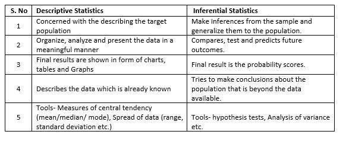

# Topics to cover in Statistics for Data Science

## Descriptive Statistics
#### Understanding what the data looks like
1. Measures of Central Tendency (Mean, Median, Mode, etc.)
2. Measures of Variability (Standard Deviation, Variance)
3. Frequency Distribution 
4. Measures of Shape (Skew of data)
5. Graphical Summaries (Different types of plots to represent the data)

## Inferential Statistics
1. Probability
2. Distribution
3. Hypothesis testing
4. Bayesian vs Frequential statistics
5. Sampling
6. Time series analysis
7. Experiment Design
8. Multi variant analysis
9. Analysis of variance (ANOVA)
10. Survival Analysis
11. Bootstrap resampling

  

Sources:

https://www.youtube.com/playlist?list=PLblh5JKOoLUK0FLuzwntyYI10UQFUhsY9